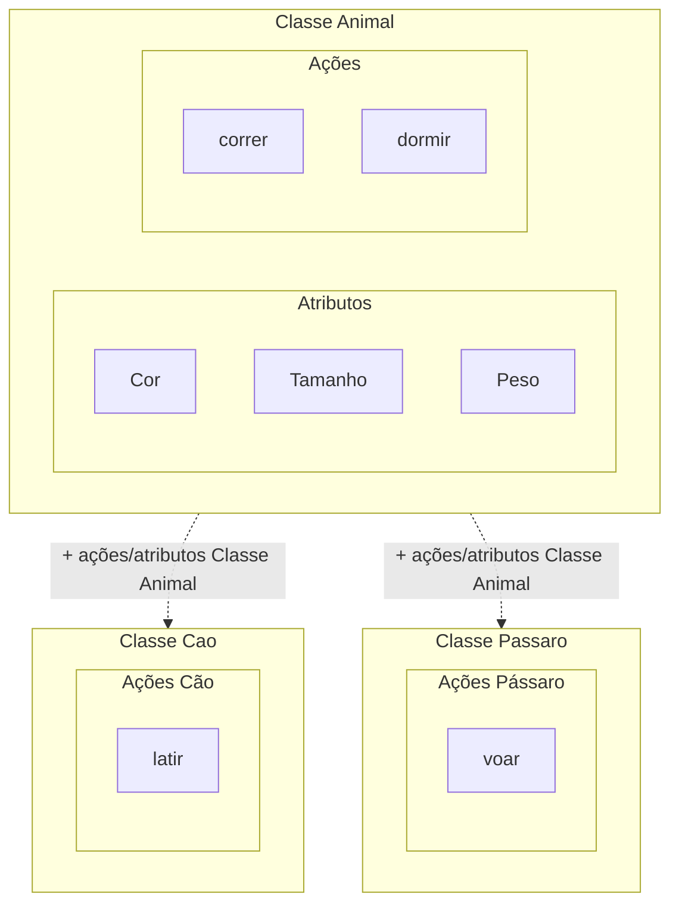

# Flutter/Dart notes

Notes gathered througth different courses and sources

## Dart 

- 2010
    - Created by Google to replace JS
    - Perform with higher speed
    - More secure
    - Easy learning

- Used in:
    - Mobile
    - Web
    - Server

## Flutter

### What it is ? 
- SDK (Software Development Kit) used to create apps for Android and iOS
- Open source created by Google

### Dart + Flutter

- Using Flutter SDK, we'll write codes for apps in Dart Programm Language
- When this code is excuted, it's generated (or compiled to) a Java code for Android plataforms and Swift code for iOS platforms in the same project.

## Variável

Área de memória associada a um nome, que pode armazenar valores de um determinado tipo. 
Ex.: a = 1

*let* para mutável e *const* para imutável - *var* pode ser utilizado para valores mutáveis, mas torna o valor global, podendo ser acessado de forma externa e não sendo muito seguro. 

let nome = 'nome';
const pi = 3.14;

### Tipos de variáveis

- *var*: tipo de variavel genérico (número, string, booleano); Ex.: var nome = 'nome'

- *String*: A palavra reservada **String** antes do nome da variável define o tipo de valor que ela deverá receber. No caso, apenas **textos**, entre "" ou ''; Ex.: String id = '123'

- *int*: A palavra reservada **int** antes do nome da variável define o tipo de valor que ela deverá receber. No caso, apenas **números inteiros**, SEM "" ou ''; Ex.: int id = 123

- *double*: A palavra reservada **double** antes do nome da variável define o tipo de valor que ela deverá receber. No caso, apenas **números decimais**, SEM "" ou ''; Ex.: double price = 19.99

- *bool*: A palavra reservada **bool** antes do nome da variável define o tipo de valor que ela deverá receber. No caso, apenas **booleanos**, SEM "" ou '', apenas TRUE ou FALSE; Ex.: bool access = false
 

## Arrays

É uma maneira de armazenar mais valores em uma mesma variável.  Ex.: let nomes = ['João', 'Maria', 'José'];

Os valores são acessíveis pelo seus índices, começando pelo 0.  Ex.: O índice de João é 0, o de Maria é 1, o de José é 2 ...

Pode-se também atribuir novos valores aos índices, caso a variável não seja uma constante 
Ex.: nomes[1] = 'Mateus';
 

## Operadores aritméticos

- Soma (+)
- Subtração (-)
- Divisão (/)
- Multiplicação (*)
- Incremento (++)
- Incremento + 1 (+=)
- Decremento (--)
- Decremento - 1(-=)
 

## Operadores relacionais
Utilizado para testes/comparação

- == (Igual)
- != (Diferente)
- '>' (Maior que)
- < (Menor que)
- '>=' (Maior ou igual)
- <= (Menor ou igual)
 

## Controle de fluxo - if else

- if (condição satisfeita)
- else (exceção)

        if(confdicao 1){
            print("True")
        }else if(condicao 2){
            print("True")
        }else{
            print("False")
        }
 

## Controle de fluxo - switch

Similar ao if/else

    switch(valor){
        case "true" : 
            print("true");
            break;
        case "false" :
            print("false");
            break;
        case "1" :
            print("number");
            break;
        case "name" :
            print("string");
            break;
        default :
            print("None of options");
    }
   

## Loops - for & while

Utilizado para exibições e listagem de itens

**while** Enquanto a condição for satisfeita, a instrução será executada. 

Ex.: Listar números até 4

    final int numero = 5;
    while(numero >= 4){
        print(numero);
    }

**for** Recebe como argumento todos os parametros para serem executados até que a condição não seja mais satisfeita.

Ex.: Listar números até 10

    for(int i = 0; i <= 10; i++){
        print(i);
    }

Ex.: Exibir postagens

    final postagens = <String>[
      "Viagem à Acapulco",
      "Vendo churros. Chamar inbox",
      "Festa na vila !"
    ];

    for(String post in postagens){
        print("Post: $post");
    }

**do while** Primeiro executa para depois testar se a condição foi satisfeita, garantindo que pelo menos 1 vez o código de instrução será executado.

    int numero = 0;
    do{
        print(numero);
        numero++;
    }while(numero <= 5);

## Funções

**main** - principal função do Dart, que executará a página

    void main(){
        
    }

novas funções podem ser criadas, sempre iniciando por letra minúscula (nunca número), respeitando o padrão de nomenclatura e evitando palavras reservadas:

    void exibirMensagem(String nome){
        print(Nome: $nome);
    }

    void main(){
        exibirMensagem('Maria');
    }

## Funções anônimas e parâmetros

    void exibirDados(String nome, {int idade, double altura}){
        final novaAltura = altura ?? 0;
        print(nome: $nome);
        print(idade: $idade);
        print(altura: $novaAltura);
    }

    void main(){
        exibirDados("Maria", idade: 36, altura: 1.58)
    }

*idade* e *altura* são parâmetros **opcionais**, pois estão dentro de { }. Para passar os valores de parâmetros opcionais, deve-se indicar o nome do parâmetro e o valor.

Em `final novaAltura = altura ?? 0;`, estamos criando a variável `novaAltura` e atribuindo a ela o parâmetro `altura` e uma verificação para valor nulo `??`. Caso ele seja nulo, será substituido por `0`, uma vez que `altura` é um parâmetro opcional e caso não seja atribuido nenhum valor, ele irá retornar nulo.

Uma boa prática é manter parâmetros opcioais sempre ao final, pois não será possível adicionar novos parêmetros obrigatórios após os opcionais.

### Passando função como parâmetro

    void calcularBonus(){
        print("Seu bônus é de: 20);
    }

    void calcularSalario(double salario, Function funcaoParametro){
        print(Seu salário é: $salario);
        funcaoParametro();
    }

    void main(){
        calcularSalario(100, calcularBonus);
    }

### Passando função anônima como parâmetro

    void calcularSalario(double salario, Function funcaoParametro){
        print(Seu salário é: $salario);
        funcaoParametro();
    }

    void main(){
        calcularSalario(100, (){
            print("Seu bônus é de: 20);
        });
    }

Normalmente utiliza-se funções anônimas quando os códigos são muito diferentes entre si, sendo trabalhoso criar uma função para cada situação

### Classes e objetos

No exemplo de uma casa, a casa seria o objeto, onde se pode realizar ações como morar, abrir janelas, acender luzes, etc; E a planta da casa seria a classe, que é um conceito, um template, que define como a casa vai ser, mas não é a casa prorpriamente dita.

#### Atributos

Objetos tem atributos, que definem as caraterísticas dos objetos, e no exemplo da casa acima, seriam como cor das paredes, tipo de janela, quantas vagas na garagem, etc.

#### Métodos

Objetos também tem métodos, que definem as ações que os objetos podem realizar, e no exemplo da casa acima, seriam como abrir portão, acender luzes, abrir janelas, etc.

    class Casa{
  
    //Atributos
    late String cor;
    
        //Métodos
        void abrirJanela(int qtdJanelas, String comodo){
            print("Abrir $qtdJanelas janela(s) da(o) $comodo");
        }
    }

    void main() {
    Casa minhaCasa = Casa();
    minhaCasa.cor = "Amarela";
    minhaCasa.abrirJanela(2, "sala");
    print("Cor da minha casa: ${minhaCasa.cor}");
    
    Casa casaVeraneio = Casa();
    casaVeraneio.cor = "Verde";
    casaVeraneio.abrirJanela(5, "cozinha");
    print("Cor da casa de veraneio: ${casaVeraneio.cor}");
    
    }

    Output:

    Abrir 2 janela(s) da(o) sala
    Cor da minha casa: Amarela
    Abrir 5 janela(s) da(o) cozinha
    Cor da casa de veraneio: Verde

#### Métodos dentro de métodos

    class Casa{
    
    //Atributos
    late String cor;
    
        //Métodos
        void abrirJanela(){
            print("Abrir janela da casa $cor");
        }
        
        void abrirPorta(){
            print("Abrir porta da casa $cor");
        }

        //
        void abrirCasa(){
            this.abrirJanela();
            this.abrirPorta();
        }
    }

    void main() {
    Casa minhaCasa = Casa();
    minhaCasa.cor = "Amarela";
    minhaCasa.abrirCasa();
    
    Casa casaVeraneio = Casa();
    casaVeraneio.cor = "Verde";
    casaVeraneio.abrirCasa();
    
    }

    Output:

    Abrir janela da casa Amarela
    Abrir porta da casa Amarela
    Abrir janela da casa Verde
    Abrir porta da casa Verde

O `this` em `abrirCasa()` é utilizado para chamar os métodos `abrirjanela()` e `abrirPorta()`, que estão dentro da mesma classe `Casa`, da qual o método `abrirCasa()`, que está chamando os demais, está inserido

Ex.: Simulando autenticação

    class Usuario{
        late String usuario;
        late String senha;
    
        void autenticar(){
            //Recuperar de DB
            
            const usuario = "mail@mail.com";
            const senha = "123456";
            
            //Autenticar
            if(this.usuario == usuario && this.senha == senha){
                print("Acesso permitido");
            }else{
                print("Acesso negado");
            }
        }
    }

    void main() {

        Usuario usuario = Usuario();
        usuario.usuario = "mail@mail.com";
        usuario.senha = "123456";
        
        usuario.autenticar();
    }
  
### Construtores

Utilizado para dar uma configuração inicial ao objeto, ao instanciá-lo, o construtor permite já passar alguns atributos iniciais ao objeto.

#### Construtor "clássico"
Após criar a classe com os atributos definidos, o construtor `Usuario(){}` será criado dentro dela, recebendo o mesmo nome da classe e os parâmetros necessários, e onde a ordem do atributos instanciados deve ser a mesma ordem dos parâmetros do construtor.

    class Usuario{
        late String usuario;
        late String senha;
        
        Usuario(String usuario, String senha){
            this.usuario = usuario;
            this.senha = senha;
            print("Configurações inicias do objeto");
        }
        
            
        void autenticar(){
            //Recuperar de DB
            
            const usuario = "mail@mail.com";
            const senha = "123456";
            
            //Autenticar
            if(this.usuario == usuario && this.senha == senha){
                print("Acesso permitido");
            }else{
                print("Acesso negado");
            }
        }
    }

    void main() {
        Usuario usuario = Usuario("mail@mail.com","123456");
        usuario.autenticar();
    }

    Output:
    "
    Configurações inicias do objeto
    Acesso permitido
    "

#### Construtor "simples"
Um modo mais simples de escrever um construtor é apenas passando parâmetros, sem instruções de código.

    class Usuario{
        late String usuario;
        late String senha;
        
        Usuario(this.usuario, this.senha);
        
        // "Named constructor"
        Usuario.nivel(this.usuario, this.senha){
            nivel = "administrador";
            print("Named constructor - usuário nível $nivel");
        }
        
        void autenticar(){
            //Recuperar de DB
            
            const usuario = "mail@mail.com";
            const senha = "123456";
            
            //Autenticar
            if(this.usuario == usuario &&   this.senha == senha){
                print("Acesso permitido");
            }else{
                print("Acesso negado");
            }
        }
    }

    void main() {
        //Usuario usuario = Usuario("mail@mail.com","123456");
        Usuario usuarioAdmin = Usuario.nivel("mail@mail.com","123456");
        //usuario.autenticar();
    }

    Output:
    "Acesso permitido"

#### "Named constructor"
Outro modo de criar um construtor é nomeando-o, o "named constructor":

    class Usuario{
        late String usuario;
        late String senha;
        late String nivel;
    
        Usuario.nivel(this.usuario, this.senha){
            nivel = "administrador";
            print("Named constructor - usuário nível $nivel");
        }
            
        void autenticar(){
            //Recuperar de DB
            
            const usuario = "mail@mail.com";
            const senha = "123456";
            
            //Autenticar
            if(this.usuario == usuario && this.senha == senha){
                print("Acesso permitido");
            }else{
                print("Acesso negado");
            }
        }
    }

    void main() {
        Usuario usuarioAdmin = Usuario.nivel("mail@mail.com","123456");
    }

    Output:
    "Named constructor - usuário nível administrador"

### Getter & Setter
**Métodos** para obter, validar (se necessário), retornar e configurar valores.

*Getter* = Obter 
*Setter* = Configurar

`get` - retorna/recupera (não atribui!) valores.

`set` - atribui valores (de variaveis ou diretamente) e também pode realizar validações antes de retornar.

    class Conta{
        double saldo = 0;
        double _saque = 0;
        
        double get saque{
            //Validações podem ser feitas antes de retornar o valor
            return this._saque;
        }
        
        set saque(double saque){
            if(saque > 0 && saque <= 500){
                this._saque = saque;
            }else{
                print("Valor máximo de saque de 500. Insira outro valor.");
            }
            
        }
    }

    void main() {
        Conta conta = Conta();
        conta.saque = 900;
    
        print(conta.saque);
    }
    
    Output:
    "
    Valor máximo de saque de 500. Insira outro valor.
    0
    "

### Herança

Classes diferentes podem criar uma relação de herança com uma classe em comum, mantendo o código melhor estruturado e mais curto.

    class Animal{
    //atributo
    late String cor;
    
        //método
        void dormir(){
            print("Dormir");
        }
    }

    // parent Class Animal - child Class Cao
    class Cao extends Animal{
        void latir(){
            print("Latir");
        }
    }

    // parent Class Animal - child Class Cao
    class Passaro extends Animal{
        void voar(){
            print("Voar");
        }
    }

    void main() {
        Cao cao = Cao();
        Passaro passaro = Passaro();
        
        cao.cor = "Caramelo";
        print("Cor do cão: ${cao.cor}");
        cao.latir();
        
        passaro.cor = "Azul";
        print("Cor do pássaro: ${passaro.cor}");
        passaro.voar();
    }

    Output:
    "
    Cor do cão: Caramelo
    Latir
    Cor do pássaro: Azul
    Voar
    "

### Sobrescrita de métodos
    class Animal{
        //atributo
        late String cor;
        
        Animal(this.cor);
        
        //método
        void dormir(){
            print("Dormir");
        }
        void correr(){
            print("Correr como um ");
        }
    }

    // parent Class Animal - child Class Cao
    class Cao extends Animal{
        String corOrelha;
        //método
        
        Cao(String cor, this.corOrelha) : super(cor);
        
        void latir(){
            print("Latir");
        }
    
        @override
        void correr(){
            //instancia o método 'correr' da parent class
            super.correr();
            print("cão");
        }
    }

    // parent Class Animal - child Class Cao
    class Passaro extends Animal{
        String corBico;
        
        Passaro(String cor, this.corBico) : super(cor);
        //método
        void voar(){
            print("Voar");
        }
    
        @override
        void correr(){
            //instancia o método 'correr' da parent class
            super.correr();
            print("pássaro");
        }
    }

    void main() {
        Cao cao = Cao("Caramelo", "Branco");
        Passaro passaro = Passaro("Amarelo", "Azul");
        
        print("Cor do passaro: ${passaro.cor}, cor do bico: ${passaro.corBico}");
    }
  
### Modificadores Static e Final

*Static* faz com que o atributo ou métodos sejam estáticos e não seja necessário instanciar a classe para acessá-los.

    class Configuracoes{
        static String identificadorApp = "ID5569JO3";
        String ativarNotificacao = "Sim";

        static void configuracaoInicial(){
            print("Executa configurações iniciais");
        }
        
    }

    void main() {
        Configuracoes config = Configuracoes();

        //Com static
        print("Com static: ${Configuracoes.identificadorApp}");

        //Sem static
        print("Sem static: ${config.ativarNotificacao}");

        Configuracoes.configuracaoInicial();
    }

    Output:
    "
    Com static: ID5569JO3
    Sem static: Sim
    Executa configurações iniciais
    "

*Final* evita, por exemplo, que uma classe seja instanciada mais de uma vez, reescrevendo atributos e valores já definidos.

    class Conta{
        late String valor;
    }

    void main() {
        final Conta conta = Conta();
        conta.valor = "Nome";
 
        // 'final' evita que a instancia abaixo ocorra, indicando erro
        conta = Conta();
        
        print(conta.valor);
    }

### Classes Abstratas

Classes abstratas recebem a keyword `abstract` no início e não permitem que se instancie elas, diferente das classes concretas que são as que já foram utilizadas acima como `class Animal`, `class Cao`, etc. Normalmente é atribuido a classes 'pai', onde são utilizadas principalmente apenas para estruturar atributos e métodos que serão utilizadas por outras classes 'filhas' e que normalmente são classes concretas.

#### Métodos Abstratos

Para que um método seja abstrato, basta remover `{ }`, mantendo apenas `( )`. 

    void correr();

Normalmente aplicado em métodos de uma classe 'pai', as classes 'filhas' são obrigadas a sobreescrever esse método.

    @override
    void correr(){
        print("Correr");
    }
 

    abstract class Animal{
    
        late String cor;
        
        //Método abstroto
        void correr();
    }

    class Cao extends Animal{
        void latir(){
            print("Latir");
        }
    
        // Método sobreescrito
        @override
        void correr(){
            print("Correr");
        }
    }

    class Passaro extends Animal{
        void voar(){
            print("Voar");
        }
        
        // Método sobreescrito
        @override
        void correr(){
            print("Correr");
        }
    }

    void main() {
        Cao cao = Cao();
        cao.latir();
        
        Passaro passaro = Passaro();
        passaro.voar();
    }

### Interface
Pode-se dizer, a grosso modo, que uma interface é um contrato que, quando assumido por uma classe, deve ser implementado.

Interface é utilizada pois podemos ter muitos objetos (classes) que podem possuir a mesma ação (métodos), porém, podem executá-las de maneiras diferentes.